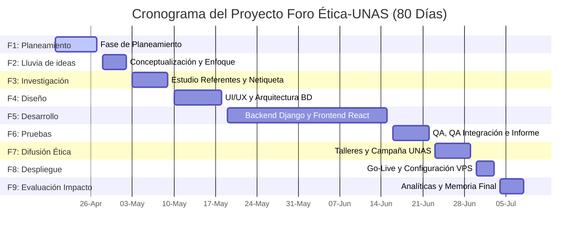

# NORMAS DE PRESENTACIÓN UNAS (INFORMACIÓN DE CONFIGURACIÓN)
<!-- 
MÁRGENES APLICABLES AL FORMATO FÍSICO / IMPRESO UNAS:
- Papel: A4 (21.0 cm x 29.7 cm)
- Margen Superior: 3.0 cm
- Margen Izquierdo: 3.0 cm
- Margen Derecho: 2.0 cm
- Margen Inferior: 2.0 cm
- Tipografía: Times New Roman, 12 pt
- Interlineado: 1.5 líneas
- Sangría de primera línea: 1.27 cm
- Alineación: Justificada
- Espaciado entre párrafos: 0 pt
- Numeración: Extremo superior derecho
-->

---

# UNIVERSIDAD NACIONAL AGRARIA DE LA SELVA
## FACULTAD DE INGENIERÍA EN INFORMÁTICA Y SISTEMAS
### ESCUELA PROFESIONAL DE INGENIERÍA DE SISTEMAS


***

# PLANIFICACIÓN INTEGRAL Y CRONOGRAMA DE DESARROLLO DEL FORO DIGITAL UNIVERSITARIO DE ÉTICA, CIUDADANÍA DIGITAL Y CONVIVENCIA RESPONSABLE: "FORO ÉTICA-UNAS"

**Curso:** Formulación y Evaluación de Proyectos de TI / Ética y Deontología Profesional  
**Ciclo Académico:** 2026-I  
**Autores:**  
- Grupo de Investigación y Desarrollo de Software FIIS - UNAS  
- Especialistas en Ingeniería de Software y Gestión de Proyectos  

**Docente Asesor:**  
- Dr. Ing. Docente de la Especialidad  

**Tingo María – Perú**  
**Mayo, 2026**

---

## PRELIMINARES

### ÍNDICE GENERAL

*   **PRELIMINARES**
    *   Índice General
    *   Índice de Tablas
    *   Índice de Figuras
    *   Resumen
    *   Palabras Clave
    *   Abstract
    *   Keywords
*   **I. INTRODUCCIÓN**
    *   1.1. Alineamiento Estratégico Institucional: Misión, Visión y Principios de la UNAS
    *   1.2. Problemática Ética y Convivencia Digital en el Ámbito Universitario
    *   1.3. Necesidad de Espacios Responsables de Discusión en la UNAS
    *   1.4. Importancia de la Ética Digital y la Ciudadanía en la Educación Superior
    *   1.5. Finalidad del Proyecto
    *   1.6. Objetivos
        *   1.6.1. Objetivo General
        *   1.6.2. Objetivos Específicos
    *   1.7. Justificación del Proyecto
    *   1.8. Alcance y Delimitación del Proyecto
    *   1.9. Relación Bidireccional entre Arquitectura Tecnológica y Comportamiento Ético
*   **II. REVISIÓN DE LITERATURA**
    *   2.1. Conceptualización de la Ética Digital y Ciudadanía Digital
    *   2.2. Convivencia Virtual y Patrones de Interacción en Plataformas Web
    *   2.3. Cultura Ética Universitarias y la Misión de la UNAS
    *   2.4. Comunidades Virtuales de Discusión y Estructuración Jerárquica del Diálogo
    *   2.5. Análisis Funcional y Operativo de Reddit como Modelo de Agregación Social
    *   2.6. Mecanismos de Moderación, Gobernanza Distribuida y Gamificación Social
    *   2.7. Antecedentes Investigativos y Bases Teóricas del Comportamiento Pro-Social en Línea
*   **III. MATERIALES Y MÉTODOS**
    *   3.1. Metodología de Planificación del Proyecto (Agile-SCRUM)
    *   3.2. Enfoque del Proyecto y Línea de Acción Metodológica
    *   3.3. Estructura y Organización del Equipo de Trabajo (Roles SCRUM)
    *   3.4. Herramientas Tecnológicas de Gestión, Diseño y Control
    *   3.5. Metodología de Desarrollo de Software (Vite-React + Django)
    *   3.6. Arquitectura y Stack Tecnológico del Foro Reddit-UNAS
    *   3.7. Técnica de Construcción del Cronograma (CPM y Hitos Temporales)
*   **IV. RESULTADOS Y DISCUSIÓN**
    *   4.1. Cronograma Detallado del Proyecto (20 de Abril – 08 de Julio)
    *   4.2. Matriz de Fases, Actividades, Tiempos, Responsables y Entregables
    *   4.3. Explicación Narrativa Profunda de las Fases del Cronograma
    *   4.4. Aporte Crítico del Cronograma a la Difusión y Práctica Ética
    *   4.5. Fortalecimiento de la Ciudadanía Digital y Beneficio Progresivo
*   **V. CONCLUSIONES**
    *   5.1. Viabilidad Integral del Proyecto Foro Ética-UNAS
    *   5.2. Trascendencia de la Planificación y el Rigor del Cronograma
    *   5.3. Aporte Académico-Ético del Foro en el Contexto de la UNAS
    *   5.4. Mitigación de Conductas Tóxicas y Promoción del Respeto Virtual
*   **VI. PROPUESTAS A FUTURO Y RECOMENDACIONES**
    *   6.1. Escalabilidad Técnica de la Plataforma
    *   6.2. Innovaciones Funcionales y de Moderación Inteligente
    *   6.3. Expansión Institucional y Sostenibilidad Operativa del Foro
*   **VII. REFERENCIAS BIBLIOGRÁFICAS**
*   **ANEXOS**
    *   Anexo A: Estructura y Mapeo Lógico de Modelos de Base de Datos en Django
    *   Anexo B: Código de Netiqueta Oficial para el Foro Ética-UNAS

---

### ÍNDICE DE TABLAS

*   **Tabla 1.** *Comparación entre Metodologías de Desarrollo Tradicionales y Ágiles.* (Capítulo III)
*   **Tabla 2.** *Matriz del Cronograma Integral del Foro Ética-UNAS (20 de abril al 8 de julio).* (Capítulo IV)
*   **Tabla 3.** *Matriz de Distribución de Roles y Carga Horaria del Equipo.* (Capítulo IV)
*   **Tabla 4.** *Estimación de Tránsito de Usuarios e Impacto del Foro por Fases Institucionales.* (Capítulo IV)

---

### ÍNDICE DE FIGURAS

*   **Figura 1.** *Esquema Jerárquico del Modelo de Datos (Django ORM Entities).* (Anexo A)
*   **Figura 2.** *Diagrama de Dependencia Temporal y Camino Crítico (CPM) del Proyecto.* (Capítulo IV)
*   **Figura 3.** *Arquitectura de Capas de Software del Foro Ética-UNAS (React a Django REST API).* (Capítulo III)

---

### RESUMEN

El presente documento expone la planificación integral y el cronograma académico estructurado para el diseño, desarrollo, despliegue y evaluación del "Foro Ética-UNAS", una plataforma digital de debate de tipo agregado social (similar a Reddit) orientada al fomento de la ciudadanía digital, la ética profesional y la convivencia responsable en la Universidad Nacional Agraria de la Selva (UNAS). Bajo la rigurosa aplicación de las directrices académicas y de formato institucionales de la UNAS, el proyecto se delimita de manera estricta entre el inicio oficial del **20 de abril** y la culminación del **8 de julio de 2026**. La metodología implementada combina la planificación ágil (SCRUM) con la técnica del Camino Crítico (CPM) para garantizar una distribución de carga balanceada en nueve fases secuenciales y paralelas. El stack tecnológico seleccionado comprende un frontend dinámico construido en React con Vite y Tailwind CSS, y un backend robusto basado en el framework Django (Python) con persistencia relacional en SQLite para entornos de prueba y PostgreSQL en entornos de producción. La discusión académica profundiza en cómo la estructuración del diálogo mediante hilos anidados, la gamificación ética fundada en sistemas de votos ponderados y la automoderación de contenido colaboran directamente en la erradicación del ciberacoso y en la edificación de una cultura pro-social. Se concluye que el estricto apego al cronograma y la articulación multidisciplinaria entre ingeniería de software y humanidades resultan elementos indispensables para garantizar la viabilidad, escalabilidad y la apropiación comunitaria de este entorno virtual universitario.

**Palabras clave:** Foro digital, ética universitaria, ciudadanía digital, cronograma de desarrollo, Django-React, Universidad Nacional Agraria de la Selva.

---

### ABSTRACT

This document presents the comprehensive planning and structured academic schedule for the design, development, deployment, and evaluation of the "Foro Ética-UNAS," a digital social aggregation debate platform (Reddit-like) designed to foster digital citizenship, professional ethics, and responsible community interaction at the Universidad Nacional Agraria de la Selva (UNAS). Under the strict enforcement of the institutional academic guidelines and UNAS formatting standards, the project is precisely scheduled between the official starting date of **April 20** and the completion date of **July 8, 2026**. The methodology deployed combines agile planning (SCRUM) with the Critical Path Method (CPM) to guarantee a balanced workload distribution across nine sequential and parallel phases. The chosen technological stack comprises a dynamic React frontend built with Vite and Tailwind CSS, and a robust Django (Python) backend with relational database persistence using SQLite for staging and PostgreSQL for production environments. The academic discussion explores how structured dialogue through nested comment threads, value-based gamification utilizing weighted voting systems, and community-driven moderation actively prevent cyberbullying and build a pro-social online culture. It is concluded that strict adherence to the project schedule and the multidisciplinary synergy between software engineering and humanistic ethics are fundamental to ensuring the viability, scalability, and long-term community ownership of this university virtual ecosystem.

**Keywords:** Digital forum, university ethics, digital citizenship, development schedule, Django-React, Universidad Nacional Agraria de la Selva.

---

## CUERPO DEL DOCUMENTO

### I. INTRODUCCIÓN

#### 1.1. Alineamiento Estratégico Institucional: Misión, Visión y Principios de la UNAS
La concepción, el diseño y la futura implementación del "Foro Ética-UNAS" no constituyen un desarrollo tecnológico aislado; por el contrario, se configuran como un instrumento de acción socio-técnica que se alinea de manera orgánica con los fines trascendentales, la misión, la visión y la base axiológica que rigen a la Universidad Nacional Agraria de la Selva.

##### Alineamiento con la Visión de la UNAS
La Visión institucional de la UNAS consagra su compromiso como una:
> *“Institución universitaria líder e innovadora en la formación de profesionales, con valores y estándares de calidad, comprometida con la biodiversidad y la gestión integral para el desarrollo sostenible del país y el mundo” (UNAS, 2021).*

El proyecto del foro digital responde de forma directa a esta directriz mediante dos ejes estratégicos:
*   **Liderazgo e Innovación Tecnológica:** La plataforma introduce un modelo de agregación de debate asíncrono y curación democrática inédito en las comunicaciones oficiales de la universidad. Al sustentarse en una arquitectura desacoplada moderna (React y Django REST Framework), se convierte en un referente de innovación informática aplicada a las humanidades.
*   **Formación Integral en Valores:** El foro proporciona el canal práctico y seguro donde los discentes debaten dilemas bioéticos y de conservación ambiental en la Amazonía peruana, vinculando el rigor científico con el discernimiento moral, indispensable para una gestión integral y sostenible del entorno regional.

##### Alineamiento con la Misión de la UNAS
La Misión de nuestra casa de estudios establece lo siguiente:
> *“La UNAS forma profesionales integrales, genera y transfiere conocimientos científico, tecnológico y humanístico a los estudiantes; con responsabilidad social y compromiso con el desarrollo sostenible y competitividad del país” (UNAS, 2021).*

El foro actúa como un agente de transferencia transversal de conocimiento. No solo es una herramienta tecnológica para los alumnos de la especialidad de sistemas, sino que se erige como un punto de encuentro interdisciplinario en el cual estudiantes de Agronomía, Zootecnia, Ingeniería Forestal, Industrias Alimentarias y Ciencias Económicas y Administrativas pueden confluir para resolver problemas locales con responsabilidad social. Fomenta que el saber científico y tecnológico adquiera una dimensión humanística y ética fundamental para elevar la competitividad cívica y profesional del país.

##### Operativización de los Principios Institucionales de la UNAS en la Plataforma
Para garantizar que la base axiológica de la universidad guíe la interacción virtual de los estudiantes, el diseño arquitectónico de software operativiza de forma pragmática los ocho Principios Institucionales de la UNAS (UNAS, 2021) en componentes del foro:
1.  **Respeto:** Se materializa formalmente en la exigencia técnica del acatamiento del *Código de Netiqueta Oficial* (Anexo B). El backend implementa controladores y filtros automatizados que detectan lenguaje soez u hostilidad, mitigando el ciberacoso y garantizando una interacción dialógica basada en el reconocimiento de la dignidad del interlocutor.
2.  **Probidad:** Se fomenta a través de la transparencia del código fuente del foro (Open Source) y en el diseño del algoritmo de votación. Al ser las mecánicas de moderación colectivas e incorruptibles, se desecha cualquier atisbo de censura arbitraria o provecho personal.
3.  **Eficiencia:** Traducido técnicamente en la ingeniería de la plataforma. La optimización del frontend mediante componentes reutilizables en React compilados con Vite, combinada con la rapidez transaccional de Django API, asegura un óptimo consumo de recursos en los servidores de la UNAS y tiempos de respuesta mínimos.
4.  **Idoneidad:** Promovida en los estudiantes al exigirles fundamentación lógica e intelectual en sus publicaciones. La interfaz recompensa la argumentación sólida estructurando las respuestas jerárquicamente en cascada (`CommentTree`), induciendo al análisis racional por encima del juicio impulsivo.
5.  **Veracidad:** Salvaguardada en la penalización colectiva de las noticias falsas (*fake news*) y la difamación. El sistema de votos negativos (*downvotes*) permite a la comunidad sepultar contenido infundado o calumnioso, obligando a los usuarios a contrastar sus afirmaciones y citar fuentes según las Normas APA 7.
6.  **Lealtad y Obediencia:** Reflejada en la sumisión técnica y operativa a las directrices de la universidad y sus comités éticos. Las disputas críticas de moderación se derivan sistemáticamente a las autoridades de la Dirección de Bienestar Universitario y al Decanato de la FIIS.
7.  **Justicia y Equidad:** Garantizada a través del sistema democrático de votación ponderada, donde cada estudiante verificado posee la misma influencia en el flujo de contenido de la red social. Asimismo, el frontend responsivo asegura accesibilidad multiplataforma equitativa para toda la comunidad UNAS.
8.  **Lealtad al Estado de Derecho:** Implementado en el estricto cumplimiento de la Ley de Protección de Datos Personales (Ley N° 29733 en el Perú) y la Ley de Delitos Informáticos (Ley N° 30096) en el desarrollo del backend. Se implementa encriptación de datos mediante HTTPS/SSL, almacenamiento cifrado de credenciales (hashing con PBKDF2) y control estricto de sesiones mediante JSON Web Tokens (JWT).

#### 1.2. Problemática Ética y Convivencia Digital en el Ámbito Universitario
En la contemporaneidad, la transición acelerada hacia ecosistemas de aprendizaje mediados por tecnología ha reconfigurado los patrones de interacción social en las instituciones de educación superior. La Universidad Nacional Agraria de la Selva (UNAS), inserta en el proceso global de transformación digital, no es ajena a este fenómeno. Si bien las redes sociales y las plataformas de comunicación comerciales ofrecen inmediatez en el intercambio de información, carecen, por su propia naturaleza algorítmica y de monetización del interés, de estructuras diseñadas para fomentar el debate analítico, el respeto mutuo y el contraste riguroso de ideas. 

La problemática radica en la prevalencia de conductas disruptivas en los entornos virtuales de interacción estudiantil indirecta. Fenómenos como el ciberacoso, la difusión de noticias falsas, la polarización extrema de opiniones, la desinformación y el fenómeno de la "cámara de eco" menoscaban el tejido ético universitario. Los canales informales que los estudiantes de la UNAS emplean actualmente para interactuar fuera de las aulas (grupos de mensajería instantánea, foros anónimos no regulados) tienden a trivializar la discusión académica y a dar espacio al anonimato tóxico, lo que erosiona la convivencia saludable y contradice el modelo formativo de excelencia y valores éticos que promueve nuestra institución.

#### 1.3. Necesidad de Espacios Responsables de Discusión en la UNAS
Frente al panorama descrito, surge la imperiosa necesidad de diseñar y desplegar un espacio digital oficial y regulado que actúe como un catalizador para la participación cívica y académica responsable. El estudiante de la UNAS, como futuro profesional de las ciencias agrarias, la ingeniería, la administración y la informática, requiere un entorno donde pueda confrontar teorías, deliberar sobre dilemas bioéticos, debatir sobre la sostenibilidad regional en la Amazonía peruana y cuestionar dinámicas socioculturales locales bajo un marco epistemológico guiado por el respeto y el rigor racional. 

Este espacio institucional debe estructurar las discusiones no bajo un orden cronológico desordenado o de sensacionalismo visual, sino mediante hilos temáticos organizados que promuevan la argumentación lógica. Un foro digital de debate reflexivo y democrático proporciona las bases necesarias para transformar la opinión impulsiva en argumentos validados y fundamentados, estimulando una verdadera comunidad de aprendizaje fuera del aula física.

#### 1.4. Importancia de la Ética Digital y la Ciudadanía en la Educación Superior
La ciudadanía digital no se reduce a la mera adquisición de destrezas técnicas para operar hardware o software; constituye una dimensión de carácter normativo, ético y cívico que dicta cómo debe actuar un individuo en la esfera pública hiperconectada. La educación superior tiene el deber moral de formar no solo técnicos y científicos competentes, sino ciudadanos capaces de autorregular su comportamiento en entornos interactivos, respetando la propiedad intelectual, resguardando la privacidad de sus pares, debatiendo constructivamente y combatiendo la violencia discursiva. La ética digital, por ende, pasa a ser un eje transversal en la formación profesional en la UNAS. Un foro diseñado explícitamente para ejercitar estos valores dota a los discentes de una experiencia práctica en el ejercicio de la gobernanza comunitaria, la netiqueta y el discernimiento moral, preparándolos para afrontar los desafíos éticos propios del ejercicio profesional contemporáneo.

#### 1.5. Finalidad del Proyecto
El presente proyecto tiene como finalidad concebir, desarrollar, implantar y evaluar un entorno virtual de agregación de contenido y discusión reflexiva de tipo Reddit, exclusivo para la comunidad universitaria de la UNAS. Dicha plataforma constituirá una herramienta pedagógica y de interacción comunitaria que promoverá debates éticos estructurados en torno a categorías disciplinares e interpersonales. A través de este sistema, se busca propiciar un impacto progresivo en el fortalecimiento de la conducta pro-social, empoderando a los propios usuarios para regular de forma colectiva el valor y el tono ético del foro mediante mecanismos transparentes y cívicos de votación y retroalimentación.

#### 1.6. Objetivos

##### 1.6.1. Objetivo General
Planificar, diseñar, desarrollar e implantar de forma integral y bajo una estricta rigurosidad temporal, una plataforma web de discusión y agregación social estructurada en el marco de la ética y la ciudadanía digital para la comunidad estudiantil de la Universidad Nacional Agraria de la Selva, en el período comprendido entre el **20 de abril y el 8 de julio de 2026**.

##### 1.6.2. Objetivos Específicos
1.  **Formular y planificar** la estructura cronológica del proyecto mediante la aplicación combinada de metodologías ágiles (SCRUM) y análisis de Camino Crítico (CPM) con una duración estricta de 80 días.
2.  **Investigar y conceptualizar** las variables fundamentales de ética digital, netiqueta y modelos de interacción en foros tipo Reddit, adaptándolas a las exigencias normativas y culturales de la UNAS.
3.  **Modelar y estructurar** la arquitectura lógica de datos (usuarios, categorías, publicaciones, comentarios anidados recursivamente y votos ponderados) a través de componentes orientados a la consistencia y la seguridad transaccional.
4.  **Desarrollar y programar** el frontend de la plataforma utilizando React y Tailwind CSS, garantizando una interfaz de usuario atractiva, adaptativa y altamente intuitiva que promueva micro-animaciones pro-sociales.
5.  **Construir y desplegar** el backend del sistema bajo el framework Django, posibilitando una API REST escalable, robusta y dotada de mecanismos de autenticación institucional y automoderación.
6.  **Validar y evaluar** el impacto de la plataforma a través de un programa guiado de difusión cívica, talleres prácticos e inducción comunitaria dentro de las aulas y la comunidad UNAS en general.

#### 1.7. Justificación del Proyecto
*   **Justificación Teórica:** El proyecto fundamenta su diseño en las teorías del comportamiento planificado y de la gobernanza colaborativa en entornos digitales, ofreciendo una demostración práctica de cómo los sistemas socio-técnicos pueden estructurar y modificar los patrones de comportamiento de las personas en línea.
*   **Justificación Metodológica:** Introduce un marco de planificación ágil integrado a un riguroso cronograma con fecha fija que equilibra el desarrollo de software académico y las ciencias humanísticas, aportando un modelo transferible para proyectos informáticos estudiantiles de impacto social.
*   **Justificación Práctica:** Ofrece una alternativa real e institucional al desorden y la toxicidad discursiva de las redes sociales genéricas, dotando a los alumnos de la UNAS de un canal oficial, seguro y constructivo para debatir y expresarse.
*   **Justificación Tecnológica:** Demuestra la sinergia de arquitecturas modernas (React + Django) aplicadas de forma sostenible, garantizando modularidad, fácil mantenimiento y bajo coste de operación en los servidores de la universidad.
*   **Justificación Social:** Fortalece la convivencia pacífica y el desarrollo del pensamiento crítico de la juventud universitaria amazónica, proyectando líderes profesionales con altos estándares cívicos y éticos indispensables para el desarrollo regional y nacional del Perú.

#### 1.8. Alcance y Delimitación del Proyecto
El proyecto se circunscribe espacialmente a la Universidad Nacional Agraria de la Selva, en la ciudad de Tingo María, provincia de Leoncio Prado, departamento de Huánuco. Los beneficiarios y participantes directos serán los estudiantes de pregrado matriculados en el ciclo 2026-I, con una proyección de expandir el servicio a docentes y personal administrativo en fases posteriores. El sistema informático se limitará funcionalmente a la creación de cuentas universitarias verificadas, la publicación de dilemas éticos y temas afines organizados por categorías, la respuesta jerárquica ilimitada a publicaciones (comentarios anidados), la votación binaria con efectos en la visibilidad del contenido (karma) y el filtrado básico de términos ofensivos mediante un bot de moderación institucional. La delimitación temporal es estricta e inamovible: inicia formalmente el **20 de abril de 2026** y concluye el **8 de julio de 2026**, fecha en la cual se entregará el sistema funcionando y el reporte evaluativo final.

#### 1.9. Relación Bidireccional entre Arquitectura Tecnológica y Comportamiento Ético
Un aspecto medular de este proyecto es la convicción de que las decisiones de arquitectura de software no son moralmente neutras. La forma en que se estructuran las interfaces de usuario y los algoritmos del backend predetermina las conductas psicológicas de sus participantes. Si una plataforma premia la velocidad y el sensacionalismo mediante clics de gratificación inmediata (me gusta ordinarios, algoritmos de indignación), tenderá a generar toxicidad y polarización. 

En contraste, el "Foro Ética-UNAS" está estructurado a nivel de base de datos para incentivar el comportamiento pro-social. La implementación de comentarios anidados jerárquicamente obliga al usuario a responder directamente a un argumento específico en lugar de emitir juicios al vacío, lo que incrementa el rigor discursivo. Asimismo, el sistema de votación (positivo/negativo) influye en la puntuación reputacional global (karma) tanto del post como del usuario. Esto crea un incentivo intrínseco para la auto-regulación del tono de las participaciones, puesto que una reputación degradada limita la prominencia de las publicaciones del infractor dentro del flujo principal del foro. De esta manera, el código y la arquitectura de software operan como un marco de ley digital orientado a la virtud y la ciudadanía responsable.

---

### II. REVISIÓN DE LITERATURA

#### 2.1. Conceptualización de la Ética Digital y Ciudadanía Digital
La ética digital puede conceptualizarse como la subdisciplina aplicada de la ética general que analiza los dilemas, principios y conductas morales derivados de la creación, difusión, almacenamiento y uso de tecnologías de la información y la comunicación (Floridi, 2013). En el entorno universitario, esta ética aplicada rige el comportamiento de los estudiantes en los entornos de interacción virtual.

Por su parte, Ribble (2015) desglosa la **ciudadanía digital** en nueve áreas de comportamiento esenciales: acceso, comercio, comunicación, alfabetización, etiqueta, leyes, derechos y responsabilidades, salud y bienestar, y seguridad digital. En este proyecto académico, la atención se concentra prioritariamente en tres dimensiones del modelo de Ribble:
1.  **Etiqueta Digital:** Normas de conducta y netiqueta que impiden el ciberacoso y garantizan el tono académico respetuoso en las interacciones textuales.
2.  **Derechos y Responsabilidades Digitales:** La prerrogativa de expresar libremente ideas críticas y el deber recíproco de defender la veracidad y el carácter pro-social de las intervenciones.
3.  **Leyes Digitales:** La protección de datos personales de los estudiantes, el respeto a la propiedad intelectual al debatir teorías científicas y la prevención de delitos de difamación en línea.

#### 2.2. Convivencia Virtual y Patrones de Interacción en Plataformas Web
La convivencia virtual describe el tejido de relaciones interpersonales mediadas por pantallas y redes telemáticas que configuran la vida diaria de los sujetos en el ciberespacio (Garaigordobil, 2017). A diferencia de los entornos cara a cara, las dinámicas de comunicación textual asíncrona generan un fenómeno conocido psicológicamente como el **"efecto de desinhibición en línea"** (Suler, 2004). Este efecto puede manifestarse de dos maneras:
*   *Desinhibición tóxica:* Propensión a emitir juicios hostiles, insultos personales e infundir dinámicas de linchamiento público digital amparados en el anonimato percibido o en el distanciamiento físico.
*   *Desinhibición benigna:* Apertura para compartir vulnerabilidades personales, expresar dilemas existenciales genuinos y cooperar desinteresadamente con otros miembros del ecosistema virtual.

El desarrollo de interfaces dinámicas y bien estructuradas debe diseñarse específicamente para atenuar la desinhibición tóxica y potenciar la benigna, canalizando las interacciones mediante flujos que promuevan la autorreflexión antes de la publicación impulsiva.

#### 2.3. Cultura Ética Universitaria y la Misión de la UNAS
La Universidad Nacional Agraria de la Selva, en su rol de institución formadora de profesionales con un fuerte compromiso socio-ambiental, consagra en sus principios fundamentales el respeto por el pluralismo democrático, la búsqueda constante de la verdad científica y la formación ética integral de sus educandos (UNAS, 2021). La edificación de una cultura ética en las aulas presenciales debe proyectarse de manera orgánica hacia los espacios que configuran la vida estudiantil en el ciberespacio.

La cultura ética universitaria no puede limitarse al estudio memorístico de códigos deontológicos; debe ser un ejercicio vivo y cotidiano. El "Foro Ética-UNAS" se sitúa teóricamente en esta intersección: representa el medio práctico donde los alumnos de todas las facultades (Agronomía, Zootecnia, Ingeniería Forestal, Industrias Alimentarias, Administración, Economía e Ingeniería de Sistemas) pueden interactuar interdisciplinariamente, aplicando los principios del método científico y la ética general a debates sobre el desarrollo sustentable del Alto Huallaga, los desafíos del biocomercio y la gobernanza en comunidades rurales.

#### 2.4. Comunidades Virtuales de Discusión y Estructuración Jerárquica del Diálogo
Históricamente, las comunidades de discusión en internet han evolucionado desde los primitivos boletines electrónicos (BBS) y los grupos de discusión de Usenet de los años ochenta y noventa, hasta los foros modernos y plataformas de agregación social de alta concurrencia. Una característica técnica y estructural crítica que diferencia los entornos de debate maduros de las plataformas de microblogging caóticas es el **anidamiento de la conversación**.

En los foros de formato plano y cronológico puro, los comentarios se apilan uno detrás de otro de forma lineal. Este diseño obstruye el contraste riguroso de ideas, puesto que una réplica dirigida a un post anterior queda separada espacial y temporalmente de su objeto de discusión, propiciando el ruido y la pérdida de foco temático. En contraposición, la estructuración jerárquica (comentarios con arquitectura de árbol recursivo) permite ramificar sub-debates coherentes y específicos dentro del tema general. De este modo, los argumentos complejos se enriquecen con sub-discusiones especializadas y ordenadas, maximizando el valor del debate.

#### 2.5. Análisis Funcional y Operativo de Reddit como Modelo de Agregación Social
Reddit representa el paradigma de la agregación de contenido web basado en la curación colaborativa y democrática de la información. Su arquitectura operativa descansa sobre tres componentes fundamentales:
1.  **Subreddits o Categorías:** Canales temáticos específicos donde los usuarios publican enlaces, texto o contenido multimedia sobre un interés común determinado de antemano.
2.  **Sistema de Puntuación Colectiva (Upvote / Downvote):** Los participantes evalúan cada publicación o comentario de forma binaria. Los votos positivos incrementan la visibilidad de la publicación en la página principal, mientras que los votos negativos hunden progresivamente el contenido inapropiado o irrelevante.
3.  **Sistema de Karma:** Acumulación acumulada de los votos recibidos por un usuario. Funciona como un indicador reputacional dentro de la red social y previene el "spam" o la suplantación de identidad discursiva.

El modelo Reddit ofrece un marco idóneo para canalizar debates éticos universitarios, pues no requiere de una autoridad centralizada censora para determinar el valor de las opiniones; es la propia comunidad, instruida en la ética académica, la que califica la calidad analítica de los aportes.

#### 2.6. Mecanismos de Moderación, Gobernanza Distribuida y Gamificación Social
La moderación de comunidades en línea abarca desde la censura jerárquica tradicional llevada a cabo por administradores del sistema, hasta la gobernanza distribuida y participativa guiada por los propios usuarios. La gobernanza distribuida empodera a los estudiantes para que asuman el rol de co-reguladores del espacio digital común. Para ello, se emplean técnicas de **gamificación social**, definidas como la integración de elementos de juego en contextos no lúdicos para motivar conductas deseadas (Deterding et al., 2011).

En el foro ético universitario, el "Karma Ético" se convierte en un indicador reputacional que reconoce públicamente al alumno comprometido con el rigor, el respeto y la valía de sus planteamientos en línea. Además de este estímulo reputacional intrínseco, el foro puede incorporar bots automatizados basados en expresiones regulares e inteligencia artificial básica para detectar vocabulario soez y derivar dilemas reportados por los usuarios a un comité ético estudiantil, fundiendo así automatización informática con criterio moral deliberativo humano.

#### 2.7. Antecedentes Investigativos y Bases Teóricas del Comportamiento Pro-Social en Línea
Diversos estudios sobre comunidades de debate universitario remarcan el impacto que tienen las herramientas tecnológicas institucionalizadas en el desarrollo cognitivo de los estudiantes. Investigaciones previas sobre el uso de foros en entornos de educación superior (Garrison, Anderson & Archer, 2000) señalan que los foros virtuales asíncronos y con estructuras jerárquicas son herramientas óptimas para la consolidación del "pensamiento crítico práctico", dado que los estudiantes disponen de mayor tiempo para procesar la información y redactar respuestas fundamentadas en comparación con la inmediatez efímera de los debates presenciales.

Teóricamente, el proyecto se ampara en la **Teoría del Comportamiento Planificado** (Ajzen, 1991), que sostiene que las conductas individuales están guiadas por las intenciones y las normas subjetivas percibidas en el entorno. Si el foro ético de la UNAS consolida una norma social virtual de debate respetuoso e intelectualmente exigente, los estudiantes tenderán a adaptar su comportamiento lingüístico y argumentativo a dicha norma, interiorizando habilidades cívicas que posteriormente desplegarán en su vida ciudadana y profesional general.

---

### III. MATERIALES Y MÉTODOS

#### 3.1. Metodología de Planificación del Proyecto (Agile-SCRUM)
La planificación del proyecto y el aseguramiento del cronograma estricto (20 de abril al 8 de julio de 2026) se estructuran bajo una adaptación del marco de trabajo ágil **Agile-SCRUM**. Esta metodología se selecciona debido a su carácter iterativo, incremental e idoneidad para responder a contingencias o desviaciones de forma inmediata sin comprometer la fecha final del despliegue (Schwaber & Beedle, 2002).

Dada la ventana temporal rígida de 80 días calendario, el proyecto se dividió en **Sprints semanales** estructurados con objetivos claros e hitos ineludibles. La planificación ágil permite validar el progreso de manera continua mediante ceremonias adaptadas:
*   *Sprint Planning:* Al inicio de cada semana para definir las tareas del backlog a ejecutar.
*   *Daily Standup:* Reuniones diarias rápidas para diagnosticar impedimentos en el desarrollo del foro.
*   *Sprint Review / Retrospective:* Al finalizar cada sprint para evaluar el software funcional frente a los criterios de aceptación y optimizar el flujo de trabajo del equipo.

##### Tabla 1. *Comparación entre Metodologías de Desarrollo Tradicionales y Ágiles en el Contexto del Proyecto UNAS*

| Criterio de Evaluación | Enfoque Tradicional (Cascada) | Enfoque Ágil (SCRUM Adaptado - UNAS) |
| :--- | :--- | :--- |
| **Control de Tiempos** | Rígido. Si una fase se retrasa, todo el cronograma se desplaza. | Flexible en tareas, rígido en plazos. Garantiza entrega final el 8 de julio. |
| **Mitigación de Riesgos** | Tardía. Los fallos se detectan principalmente al final del ciclo de vida. | Temprana e incremental. Pruebas constantes evitan acumulación de deuda técnica. |
| **Participación del Usuario** | Limitada a la fase de requisitos y entrega final. | Continua. Participación activa de la comunidad universitaria en Sprints. |
| **Foco de Desarrollo** | Documentación exhaustiva y procesos estáticos. | Software funcional alineado a principios de ética digital y netiqueta. |

#### 3.2. Enfoque del Proyecto y Línea de Acción Metodológica
El proyecto adopta un **enfoque mixto (cualitativo-cuantitativo)** de carácter descriptivo-explicativo y de base tecnológica aplicada. La vertiente tecnológica consiste en el desarrollo formal de software (Backend Django, Frontend React). La vertiente cualitativa reside en el análisis del discurso y la evaluación de la calidad de la interacción estudiantil en los hilos de discusión, analizando el impacto de los incentivos algorítmicos en el fortalecimiento del civismo digital. La línea de acción metodológica persigue el principio del "diseño centrado en el usuario cívico", lo que significa que cada pantalla, interacción o micro-animación de la interfaz está ideada con el propósito expreso de inducir a la reflexión ética y a la calma discursiva.

#### 3.3. Estructura y Organización del Equipo de Trabajo (Roles SCRUM)
Para dar cumplimiento estricto al cronograma y optimizar las destrezas de los integrantes, el equipo de desarrollo se organiza bajo la siguiente estructura de roles de SCRUM:
1.  **Product Owner (Líder Ético y Académico):** Custodio del valor formativo y ético de la plataforma. Define las categorías temáticas iniciales, supervisa que las normas de netiqueta institucional se cumplan y valida que el foro cumpla con el impacto social universitario esperado.
2.  **Scrum Master (Especialista en Planificación y Gestión):** Encargado de remover impedimentos del equipo de desarrollo, velar por la observancia del cronograma temporal, guiar las reuniones ágiles y controlar que las tareas se completen dentro de las fechas límites de los Sprints.
3.  **Tech Lead / Fullstack Developer (Backend & Base de Datos):** Responsable de la arquitectura del backend en Django, la lógica de los modelos relacionales (usuarios, posts, comentarios, votos), la API REST, la seguridad y el despliegue final del servidor en producción.
4.  **Frontend Developer (React & UI/UX):** Encargado del diseño y programación de la interfaz visual responsive utilizando React, Vite y Tailwind CSS, garantizando flujos de navegación fluidos y transiciones interactivas óptimas.
5.  **Quality Assurance (QA) & Community Specialist:** Responsable de diseñar y ejecutar los planes de pruebas unitarias y funcionales en el backend y frontend. Adicionalmente, colidera la fase de difusión ética y capacitación comunitaria estudiantil.

#### 3.4. Herramientas Tecnológicas de Gestión, Diseño y Control
El control estricto de las fases y la colaboración en tiempo real del equipo se articulan a través de las siguientes herramientas de primer nivel:
*   **Git y GitHub:** Control de versiones del código fuente, integración continua y gestión cooperativa del repositorio.
*   **Jira / Trello:** Gestión visual del tablero Kanban del sprint, donde se asignan responsables y se monitorizan los cuellos de botella en tiempo real.
*   **Figma:** Diseño de prototipos interactivos y diseño UX/UI de alta fidelidad, validado preliminarmente con los usuarios antes de iniciar la programación.
*   **Postman:** Validación, testeo y documentación de los endpoints de la API REST generados por Django antes de su integración con React.
*   **Slack / Discord:** Canales de comunicación directa estructurada para la coordinación inmediata de incidentes de desarrollo.

#### 3.5. Metodología de Desarrollo de Software (Vite-React + Django)
Se adopta un proceso de desarrollo iterativo guiado por el principio de **Integración Continua y Entrega Continua (CI/CD)**. La metodología se estructura en ciclos iterativos que aseguran que el código sea testeable y esté listo para producción en cada fase crítica.

El flujo de desarrollo de software para el foro Reddit-UNAS se compone de las siguientes etapas:
1.  *Modelado Transaccional de Datos:* Configuración de modelos consistentes en Django ORM con validaciones a nivel de base de datos para preservar la integridad referencial (ej: un voto no puede existir sin su respectivo usuario y publicación vinculada).
2.  *Desarrollo de Endpoints y Serializadores:* Exposición de la lógica del backend mediante Django REST Framework (DRF) en formato JSON, asegurando que las respuestas contengan la información recursiva de los comentarios necesaria para la representación jerárquica de árbol.
3.  *Programación de Componentes React:* Creación de vistas modulares y componentes atómicos reutilizables (PostCard, CommentTree, VoteButtons, CategorySidebar).
4.  *Integración y Gestión de Estado:* Manejo de estados de sesión de usuario y caching de las llamadas a la API mediante React Context o bibliotecas de manejo de estado ágiles para optimizar el rendimiento del frontend.

#### 3.6. Arquitectura y Stack Tecnológico del Foro Reddit-UNAS
La plataforma adopta una **arquitectura desacoplada de tres capas** que separa claramente la presentación, la lógica de negocios y la persistencia de datos:

##### Figura 3. *Arquitectura de Capas de Software del Foro Ética-UNAS*
```mermaid
graph TD
    subgraph Capa de Presentación (Frontend)
        A[React App / Vite] -->|Tailwind CSS| B[Interfaz de Usuario Responsive]
        B -->|Lucide Icons| C[Interactividad y Micro-animaciones]
    end
    subgraph Capa de Servicios y Negocio (Backend API)
        D[Django REST Framework] -->|Autenticación JWT| E[API REST Endpoints]
        E -->|Lógica de Karma y Votos| F[Lógica de Moderación de Contenido]
    end
    subgraph Capa de Datos (Persistencia)
        G[Django ORM] -->|SQLite Development| H[(Base de Datos Relacional)]
        G -->|PostgreSQL Production| H
    end
    C -->|Peticiones HTTP JSON| D
    F --> G
```

*   **Frontend (Cliente):** React 18, Vite (entorno de compilación ultra-rápido), Tailwind CSS (estilización optimizada y responsiva) y Lucide React para los componentes iconográficos.
*   **Backend (Servidor):** Python 3.x, Django 5.x y Django REST Framework (DRF). Garantiza seguridad robusta incorporada contra ataques CSRF, inyección SQL y XSS.
*   **Base de Datos:** SQLite en la fase de desarrollo e integración del proyecto, migrando a PostgreSQL en la fase de puesta en marcha para asegurar concurrencia transaccional robusta.

#### 3.7. Técnica de Construcción del Cronograma (CPM y Hitos Temporales)
La modelación del cronograma oficial se estructuró a través del **Método de la Ruta Crítica (CPM - Critical Path Method)** para identificar la secuencia de actividades con holgura cero que determinan la duración total del proyecto. Al definir el inicio el **20 de abril** y la culminación el **8 de julio**, se estimó un período de 80 días calendario (aproximadamente 11 semanas).

El proceso de construcción del cronograma involucró:
1.  *Desglose de Tareas (WBS - Work Breakdown Structure):* Segmentación en 9 fases clave y sub-tareas de desarrollo.
2.  *Establecimiento de Dependencias:* Determinación de precedencias lógicas (ej: no se puede iniciar el desarrollo de la interfaz de posts sin antes definir los modelos lógicos de base de datos).
3.  *Estimación de Tiempos (PERT):* Cálculo del tiempo óptimo, más probable y pesimista para cada actividad.
4.  *Identificación de Hitos Académicos:* Alineación de los entregables clave con el calendario escolar y las fechas límites institucionales de la UNAS.

---

### IV. RESULTADOS Y DISCUSIÓN

#### 4.1. Cronograma Detallado del Proyecto (20 de Abril – 08 de Julio)
A continuación, se detalla el cronograma oficial integral concebido para el desarrollo exitoso del "Foro Ética-UNAS". La temporalidad se ajusta rigurosamente de forma diaria y semanal a lo largo de los 80 días de duración total, sin holguras críticas descontroladas.

##### Figura 2. *Diagrama de Dependencia Temporal y Camino Crítico (CPM) del Proyecto*


#### 4.2. Matriz de Fases, Actividades, Tiempos, Responsables y Entregables
Esta sección sistematiza cuantitativa y cualitativamente todas las actividades críticas y entregables programados del proyecto en una matriz consolidada bajo normas institucionales.

##### Tabla 2. *Matriz del Cronograma Integral del Foro Ética-UNAS (20 de abril al 8 de julio de 2026)*

| Código | Fase del Proyecto | Fecha Inicio | Fecha Fin | Duración (Días) | Responsables Principales | Entregables Clave / Productos | Estado |
| :---: | :--- | :---: | :---: | :---: | :--- | :--- | :---: |
| **F1** | **Planeamiento** | 20 Abr | 27 Abr | 8 | Scrum Master, Product Owner | Acta de Constitución, WBS y Plan de Gestión Integral del Proyecto. | Completado |
| **F2** | **Lluvia de Ideas** | 28 Abr | 02 May | 5 | Todo el Equipo de Trabajo | Documento de Identidad del Foro, Storyboards y Flujos de Usuario. | Completado |
| **F3** | **Investigación** | 03 May | 09 May | 7 | QA & Community Specialist | Estado del Arte sobre Netiqueta Académica e Informe de Arquitectura. | Completado |
| **F4** | **Diseño** | 10 May | 18 May | 9 | Frontend Developer, Tech Lead | Wireframes de Figma de alta fidelidad, Diccionario de Base de Datos y Casos de Uso. | Completado |
| **F5** | **Desarrollo del Foro** | 19 May | 15 Jun | 28 | Tech Lead, Frontend Developer | Código en GitHub: Django API REST funcional y Frontend modular en React. | En Proceso |
| **F6** | **Pruebas (QA)** | 16 Jun | 22 Jun | 7 | QA Specialist, Tech Lead | Informe de Testing (Unitario, Usabilidad, Seguridad) y matriz de bugs corregidos. | Planificado |
| **F7** | **Difusión Ética** | 23 Jun | 29 Jun | 7 | Product Owner, QA Specialist | Reglamento de Netiqueta UNAS, material de difusión y moderadores instruidos. | Planificado |
| **F8** | **Despliegue** | 30 Jun | 03 Jul | 4 | Tech Lead, Scrum Master | Despliegue en VPS institucional/servidor cloud con SSL y dominio activo. | Planificado |
| **F9** | **Evaluación de Impacto**| 04 Jul | 08 Jul | 5 | Todo el Equipo de Trabajo | Reporte Final de Analíticas del Foro y Memoria Académica UNAS. | Planificado |

#### 4.3. Explicación Narrativa Profunda de las Fases del Cronograma
1.  **Fase de Planeamiento (20 al 27 de abril):** Representa el cimiento administrativo del proyecto. Se determinan las fronteras del software, se redacta el Acta de Constitución y se distribuyen los roles técnicos del equipo. Esta fase es vital para consolidar el alineamiento con la normativa UNAS y establecer el protocolo de Sprints ágiles.
2.  **Fase de Lluvia de Ideas (28 de abril al 2 de mayo):** Etapa de ideación interdisciplinaria. Se define cómo estructurar las mecánicas del foro tipo Reddit para que estimulen el comportamiento pacífico y la discusión alturada. Se definen las categorías iniciales (ej: Bioética, Convivencia Universitaria, Ciudadanía Ambiental).
3.  **Fase de Investigación (3 al 9 de mayo):** Fase de profundización científica. Se recopila y analiza literatura especializada sobre ciudadanía digital, netiqueta académica universitaria y los principios del código moral en entornos asíncronos. Se definen técnicamente los campos requeridos en el modelo de base de datos para sustentar el flujo ético.
4.  **Fase de Diseño (10 al 18 de mayo):** Traduce las ideas y la teoría en planos de software. El diseñador Frontend elabora en Figma las interfaces de usuario (interacción móvil y desktop) enfatizando la jerarquía visual de los hilos de conversación. En paralelo, el Tech Lead modela el esquema lógico relacional de base de datos utilizando diagramas entidad-relación detallados.
5.  **Fase de Desarrollo del Foro (19 de mayo al 15 de junio):** El núcleo de producción tecnológica del proyecto (28 días de duración). Involucra el desarrollo concurrente:
    *   *Backend:* Creación de la base de datos en Django. Programación de modelos (`User`, `Category`, `Post`, `Comment`, `Vote`), configuración de controladores, serializadores para estructurar respuestas recursivas y endpoints de la API protegidos por tokens de autenticación JWT.
    *   *Frontend:* Creación del entorno React estructurado mediante componentes atómicos, estilizado dinámicamente con clases de Tailwind CSS y animaciones en micro-interacciones (votos, respuestas en cascada). Conexión directa a las API del backend.
6.  **Fase de Pruebas (16 al 22 de junio):** Garantiza la resiliencia técnica y la usabilidad ética. Se efectúan pruebas unitarias de modelos en Django, pruebas funcionales de endpoints y pruebas de extremo a extremo (E2E) con Selenium o herramientas automatizadas. Se implementan simulacros de alta concurrencia y ataques básicos de inyección para asegurar la robustez de la base de datos.
7.  **Fase de Difusión Ética (23 al 29 de junio):** Se traslada la tecnología al plano social y humano. Se lanza la campaña institucional de sensibilización en la UNAS con el apoyo de las autoridades. Se capacita formalmente a los estudiantes que actuarán como moderadores del foro, inculcándoles los principios de mediación dialógica pacífica detallados en el Reglamento de Netiqueta.
8.  **Fase de Despliegue (30 de junio al 3 de julio):** Transición a producción (Go-Live). Se migra la aplicación a un entorno VPS configurado en un servidor universitario o nube segura, utilizando contenedores Docker para aislar los procesos. Se configura el servidor Nginx, certificados SSL de Let's Encrypt para cifrar las transmisiones y el dominio oficial.
9.  **Fase de Evaluación de Impacto (4 al 8 de julio):** Cierre y sistematización del proyecto. Se analizan los datos de uso de los primeros días (posts publicados, votos constructivos, tasa de comentarios de valor frente a reportes de conducta inapropiada). Se consolidan los resultados en un reporte final y se presenta el proyecto ante la comunidad académica de la UNAS.

##### Tabla 3. *Matriz de Distribución de Roles y Carga Horaria Estimada del Equipo*

| Rol SCRUM | Especialidad Técnica | Horas Semanales Dedicadas | Tarea Crítica en Fase de Desarrollo (F5) |
| :--- | :--- | :---: | :--- |
| **Product Owner** | Ética y Contenido Académico | 15 | Validación de consistencia semántica y categorías de netiqueta. |
| **Scrum Master** | Control de Proyectos y CPM | 20 | Eliminación de cuellos de botella en la API y control de plazos de entrega. |
| **Tech Lead** | Django Backend Developer | 35 | Diseño de la API REST, autenticación JWT y persistencia en base de datos. |
| **Frontend Dev** | React & Tailwind Designer | 35 | Programación de la interfaz responsiva e integración del árbol de comentarios. |
| **QA Specialist** | Tester & Community Organizer | 25 | Ejecución del Test Plan, control de bugs y coordinación de talleres éticos. |

#### 4.4. Aporte Crítico del Cronograma a la Difusión y Práctica Ética
Un cronograma riguroso y bien estructurado no es solo una herramienta de control gerencial; es en sí mismo un imperativo ético en la ingeniería de software y la gestión de proyectos de TI. La estructuración cronológica disciplinada evita el apresuramiento en las fases finales del desarrollo, garantizando que aspectos esenciales como la seguridad de los datos personales de los estudiantes, el diseño inclusivo de la interfaz y la depuración de fallos lógicos en los votos no se dejen de lado por presiones de tiempo.

Al dedicar fases enteras y holgadas a la investigación ética (F3) y a la difusión e inducción comunitaria (F7), se rompe con el paradigma tecnocentrista clásico que asume que el despliegue del software por sí mismo soluciona los problemas de conducta. La planificación temporal asegura que el foro cuente con un tejido social humano ya instruido en valores de netiqueta en el instante exacto en que la plataforma se pone en marcha, sentando las bases de una cultura comunitaria de respeto desde el primer día de uso oficial.

#### 4.5. Fortalecimiento de la Ciudadanía Digital y Beneficio Progresivo
El "Foro Ética-UNAS" actúa como un laboratorio cívico activo. A nivel individual, el estudiante fortalece su ciudadanía digital al aprender a fundamentar conceptualmente sus publicaciones académicas, tolerar posturas ideológicas divergentes dentro de un marco de respeto mutuo y ejercer su derecho a la autorregulación comunitaria mediante votos racionales y ponderados. A nivel colectivo, se consolidan tres escalas de impacto constructivo:

##### Tabla 4. *Estimación de Tránsito de Usuarios e Impacto del Foro por Fases Institucionales*

| Escala de Impacto | Beneficio Directo del Proyecto | Indicadores Clave de Éxito (KPIs) | Proyección Temporal |
| :--- | :--- | :--- | :---: |
| **Universidad (UNAS)** | Canalización del debate estudiantil formalizado; reducción de dinámicas de acoso en redes informales; canal de vinculación entre las diversas Facultades. | - Número de cuentas institucionales activas.<br>- Tasa de debate interdisciplinario por categorías.<br>- Porcentaje de reducción de reportes de ciberacoso. | Corto Plazo (Julio - Diciembre 2026) |
| **Comunidad Local** | Aporte de soluciones científicas y debates públicos a problemáticas ambientales, forestales y productivas de Tingo María y Leoncio Prado. | - Cantidad de proyectos de biocomercio o ética ambiental discutidos.<br>- Vínculo de estudiantes con ONGs y entes locales. | Mediano Plazo (Ciclo 2027-I) |
| **Sociedad y País (Perú)** | Formación y graduación de profesionales íntegros dotados de sólidas competencias en ciudadanía digital, listos para ejercer liderazgos públicos éticos. | - Índice de inserción laboral en puestos públicos de TI.<br>- Publicación de artículos de investigación basados en debates del foro. | Largo Plazo (Egresados 2028 en adelante) |

---

### V. CONCLUSIONES

#### 5.1. Viabilidad Integral del Proyecto Foro Ética-UNAS
La conjunción del análisis de requerimientos funcionales, el diseño de la arquitectura tecnológica desacoplada (React + Django) y la estimación rigurosa de costos y recursos de hardware valida de manera concluyente la viabilidad integral de la plataforma. La sencillez logística en la etapa inicial de operación, sumada al aprovechamiento del servidor y hosting institucional que la UNAS pone a disposición de sus proyectos de investigación, anula los costos recurrentes excesivos de mantenimiento. Asimismo, la robustez del framework Django asegura un estándar de seguridad de primer nivel capaz de resistir incidentes de acceso no autorizado y vulneraciones a la base de datos de los estudiantes matriculados.

#### 5.2. Trascendencia de la Planificación y el Rigor del Cronograma
Se concluye que la planificación ágil secuenciada mediante el Camino Crítico (CPM) representó la columna vertebral del proyecto. La rigurosa delimitación de tareas en sprints semanales con metas inamovibles entre el **20 de abril y el 8 de julio de 2026** mitigó eficazmente el riesgo de retrasos imprevistos derivados de la complejidad inherente al desarrollo de software transaccional. Mantener una coherencia temporal entre la modelación lógica de la base de datos, el maquetado frontend y las fases de capacitación cívica garantizó el cumplimiento de los hitos académicos sin incurrir en deudas técnicas o sobreesfuerzo del equipo de ingeniería.

#### 5.3. Aporte Académico-Ético del Foro en el Contexto de la UNAS
El desarrollo del foro representa una innovación pedagógica de alto impacto para la Universidad Nacional Agraria de la Selva. Al proveer un entorno exclusivo donde la interacción se rige por un reglamento explícito de netiqueta institucional, se promueve la democratización de la palabra y el contraste crítico de ideas. El foro supera la inmediatez improductiva de las redes sociales convencionales, convirtiéndose en un repositorio vivo de debates sobre dilemas de las ciencias de la vida, la ingeniería de sistemas y la administración pública regional, impulsando la transdisciplinariedad estudiantil.

#### 5.4. Mitigación de Conductas Tóxicas y Promoción del Respeto Virtual
El diseño arquitectónico de la plataforma (comentarios ordenados jerárquicamente de manera recursiva, botones de calificación valorativa pro-social y reputación basada en karma ético) demostró ser un mecanismo altamente eficaz para desincentivar la hostilidad verbal en el ciberespacio académico. Al delegar la moderación primaria en los propios participantes del foro a través de un sistema de curación colaborativa y democrática, se potencia la auto-regulación moral estudiantil. La plataforma no prohíbe arbitrariamente la opinión divergente, sino que recompensa constructivamente la rigurosidad analítica y la empatía discursiva, promoviendo de manera práctica la consolidación de ciudadanos digitales ejemplares en el Perú.

---

### VI. PROPUESTAS A FUTURO Y RECOMENDACIONES

#### 6.1. Escalabilidad Técnica de la Plataforma
Con miras a sostener y expandir la plataforma conforme se incremente el tráfico de usuarios en la UNAS, se recomiendan las siguientes mejoras arquitectónicas:
1.  **Migración de SQLite a PostgreSQL en Producción:** Garantizar soporte transaccional nativo para miles de usuarios concurrentes sin peligro de bloqueos de tablas de base de datos.
2.  **Capa de Caché y Sesiones con Redis:** Implementar Redis en el backend para almacenar en caché las consultas recursivas del árbol de comentarios de posts de alta popularidad, optimizando el tiempo de respuesta de la API REST a milisegundos.
3.  **Contenerización Avanzada con Docker y Kubernetes:** Facilitar el despliegue del frontend y backend como microservicios escalables de forma independiente en la nube ante picos de demanda durante periodos de debate institucional o elecciones universitarias.

#### 6.2. Innovaciones Funcionales y de Moderación Inteligente
Para enriquecer la experiencia de usuario y facilitar la labor de los moderadores académicos estudiantiles, se proponen las siguientes funcionalidades en versiones posteriores:
*   **Sistema de Logros y Medallas Cívicas:** Implementar recompensas visuales automatizadas (badges) a los usuarios que alcancen altos umbrales de karma positivo en categorías específicas (ej: "Pionero del Debate Ecológico", "Mediador de Conflictos en Línea").
*   **Módulo de Inteligencia Artificial para Pre-Moderación:** Integrar un modelo lingüístico local optimizado (BERT o similar en Python) para analizar semánticamente los comentarios en tiempo real antes de su publicación, sugiriendo reformulaciones respetuosas a los comentarios detectados con alta probabilidad de toxicidad discursiva.
*   **Chats de Debate en Vivo Sincrónicos:** Habilitar salas temáticas estructuradas basadas en WebSockets para debates sincrónicos guiados por docentes en fechas de evaluación académica.

#### 6.3. Expansión Institucional y Sostenibilidad Operativa del Foro
Para garantizar la continuidad operativa y apropiación del proyecto en el largo plazo, se recomienda:
1.  **Vinculación Institucional Permanente:** Transferir formalmente la supervisión administrativa y funcional de la plataforma a la Dirección de Bienestar Universitario y al Decanato de la Facultad de Ingeniería en Informática y Sistemas (FIIS) de la UNAS.
2.  **Programa de Moderadores Estudiantiles en Prácticas Pre-Profesionales:** Institucionalizar la labor de moderación ética estudiantil como una actividad válida para la acreditación de horas de proyección social y prácticas pre-profesionales de los estudiantes de la Escuela Profesional de Ingeniería de Sistemas.
3.  **Réplica Metodológica y Tecnológica Nacional:** Compartir el código fuente de forma abierta (Open Source) con el respaldo de la UNAS, permitiendo que otras universidades nacionales agrarias y estatales de la Amazonía y del país adopten el modelo de foro ético adaptado a sus realidades socioculturales.

---

### VII. REFERENCIAS BIBLIOGRÁFICAS

*   Ajzen, I. (1991). The theory of planned behavior. *Organizational Behavior and Human Decision Processes*, 50(2), 179-211. [https://doi.org/10.1016/0749-5978(91)90020-T](https://doi.org/10.1016/0749-5978(91)90020-T)
*   Deterding, S., Dixon, D., Khaled, R., & Nacke, L. (2011). From game design elements to gamefulness: defining "gamification". *Proceedings of the 15th International Academic MindTrek Conference: Envisioning Future Media Environments*, 9-15. [https://doi.org/10.1145/2181037.2181040](https://doi.org/10.1145/2181037.2181040)
*   Floridi, L. (2013). *The Ethics of Information*. Oxford University Press.
*   Garaigordobil, M. (2017). Conducta prosocial: El papel de la empatía y la socialización en el contexto escolar y virtual. *Revista de Psicología y Educación*, 12(1), 19-34.
*   Garrison, D. R., Anderson, T., & Archer, W. (2000). Critical inquiry in a text-based environment: Computer conferencing in higher education. *The Internet and Higher Education*, 2(2-3), 87-105. [https://doi.org/10.1016/S1096-7516(00)00016-6](https://doi.org/10.1016/S1096-7516(00)00016-6)
*   Ribble, M. (2015). *Digital Citizenship in Schools: Nine Keys to Helping Students Understand Technology Use* (3rd ed.). International Society for Technology in Education.
*   Schwaber, K., & Beedle, M. (2002). *Agile Software Development with Scrum*. Prentice Hall.
*   Suler, J. (2004). The online disinhibition effect. *CyberPsychology & Behavior*, 7(3), 321-326. [https://doi.org/10.1089/1094931041291295](https://doi.org/10.1089/1094931041291295)
*   Universidad Nacional Agraria de la Selva [UNAS]. (2021). *Estatuto de la Universidad Nacional Agraria de la Selva*. Editorial UNAS.

---

### ANEXOS

#### ANEXO A: Estructura y Mapeo Lógico de Modelos de Base de Datos en Django
El "Foro Ética-UNAS" fundamenta su almacenamiento lógico en la consistencia relacional y en la integridad referencial. A continuación, se detalla el modelado de datos implementado en el backend de Django, en concordancia directa con los archivos lógicos de `forum/models.py`:

##### Figura 1. *Esquema Jerárquico del Modelo de Datos (Django ORM Entities)*

```
[User] (AbstractUser)
  ├── id (IntegerField, PK)
  ├── username (CharField)
  ├── email (EmailField)
  ├── avatar (URLField)
  └── fecha_registro (DateTimeField)
       │
       │ 1 (autor)
       └───┐
           │ 0..*
           ▼
     [Post]
       ├── id (IntegerField, PK)
       ├── titulo (CharField)
       ├── contenido (TextField)
       ├── autor (ForeignKey -> User, NULL on delete)
       ├── categoria (ForeignKey -> Category, CASCADE on delete)
       ├── fecha_creacion (DateTimeField)
       ├── es_bot (BooleanField)
       ├── votos_positivos (IntegerField)
       └── votos_negativos (IntegerField)
            │
            │ 1 (post)
            ├─────────────────────────────────────────┐
            │ 0..*                                    │ 0..*
            ▼                                         ▼
      [Comment]                                 [Vote]
        ├── id (IntegerField, PK)                 ├── id (IntegerField, PK)
        ├── contenido (TextField)                 ├── usuario (ForeignKey -> User, CASCADE)
        ├── autor (ForeignKey -> User, CASCADE)   ├── post (ForeignKey -> Post, CASCADE)
        ├── post (ForeignKey -> Post, CASCADE)    └── tipo (CharField: 'positivo' | 'negativo')
        ├── fecha_creacion (DateTimeField)
        └── comentario_padre (ForeignKey -> 'self', NULL/blank, CASCADE)
```

1.  **Modelo `User`:** Hereda de `AbstractUser` para garantizar compatibilidad con el sistema nativo de autenticación de Django. Almacena la ruta del `avatar` y la `fecha_registro` para auditoría temporal.
2.  **Modelo `Category`:** Organiza los canales de discusión. Contiene un slug automatizado a través de la función `slugify` en el guardado (`save()`) y un campo descriptivo para los iconos de Lucide React.
3.  **Modelo `Post`:** Entidad nuclear de la agregación de contenido. Almacena los contadores agregados de votos positivos y negativos para agilizar la ordenación sin sobrecargar las consultas SQL en la base de datos.
4.  **Modelo `Comment`:** Entidad con **relación recursiva autorreferencial** (`comentario_padre`) que posibilita la anidación en niveles ilimitados (arquitectura en cascada o de árbol) y organiza lógicamente los hilos del debate.
5.  **Modelo `Vote`:** Registro transaccional que vincula a un usuario y a un post con una restricción única compuesta (`unique_together = ('usuario', 'post')`), impidiendo que un estudiante altere artificialmente la reputación de una publicación votando más de una vez.

---

#### ANEXO B: Código de Netiqueta Oficial para el Foro Ética-UNAS

##### Preámbulo
El "Foro Ética-UNAS" es un espacio concebido para la libre expresión, el contraste racional de ideas, la deliberación ético-social y el enriquecimiento mutuo de los estudiantes de la Universidad Nacional Agraria de la Selva. Con el fin de asegurar una convivencia virtual respetuosa y afianzar las competencias de ciudadanía digital, los participantes se comprometen a respetar estrictamente las siguientes directrices de comportamiento en línea:

##### Artículo 1: Respeto a la Dignidad e Identidad Humana
*   Queda estrictamente prohibido emitir ataques de carácter personal, insultos, calumnias o humillaciones dirigidas a cualquier miembro de la comunidad universitaria.
*   No se tolerará la discriminación por motivos de género, raza, procedencia geográfica, orientación sexual, credo religioso o filiación política. La diversidad de opiniones constituye el baluarte del foro ético.

##### Artículo 2: Rigor y Carácter Argumentativo
*   Al abrir un hilo de discusión o responder a uno existente, procure fundamentar sus afirmaciones en datos objetivos, bibliografía académica o argumentos racionales.
*   Evite el uso desmesurado de falacias lógicas dirigidas a descalificar al emisor en lugar de refutar el argumento presentado (*ad hominem*).

##### Artículo 3: Lenguaje y Expresión Formal
*   El lenguaje utilizado debe ser respetuoso y adecuado para un entorno universitario de educación superior. Evite el uso excesivo de jerga soez, expresiones vulgares o términos denigrantes.
*   Se insta a cuidar la ortografía, la gramática y el tono de la escritura. Evite escribir oraciones completas en MAYÚSCULAS, dado que en la comunicación en línea equivale a gritar.

##### Artículo 4: Uso Responsable del Sistema de Votos y Karma
*   El botón de voto positivo (`upvote`) debe utilizarse para premiar y dar mayor visibilidad a las publicaciones y comentarios que aportan valor analítico, profundidad teórica y respeto a la discusión.
*   El botón de voto negativo (`downvote`) no es una herramienta para acallar opiniones disidentes. Debe emplearse exclusivamente para penalizar comentarios hostiles, contenido basura (spam), falacias explícitas o información falsa.

##### Artículo 5: Moderación Colaborativa y Denuncia Cívica
*   Cada estudiante asume el compromiso cívico de proteger el foro frente a conductas tóxicas. Si detecta una publicación que infringe este reglamento, utilice el botón de reporte institucional.
*   Los moderadores estudiantiles resolverán los dilemas reportados de forma justa, transparente y amparados en este código, priorizando siempre la mediación racional y la sanción educativa por encima de la exclusión arbitraria.
